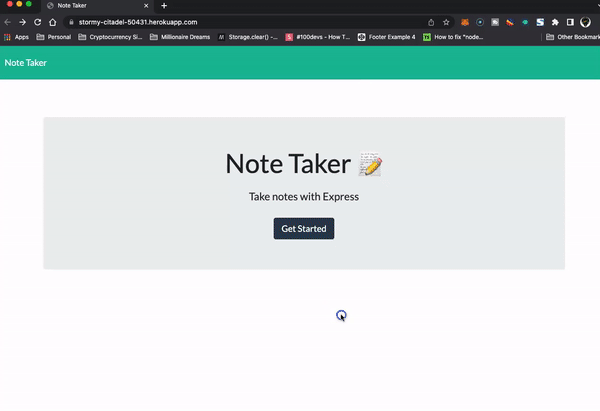

# Note Taker 

## License

Please click on the badge to view license info.
   
## Description
This assignment was to modify starter code to create an application called Note Taker that can be used to write and save notes. This application will use an Express.js back end and will save and retrieve note data from a JSON file. The application’s front end was already created. It was required to build the back end, connect the two, and then deploy the entire application to Heroku.

## Deployment Link

https://stormy-citadel-50431.herokuapp.com/

## Table of Contents

- [License](#license)
- [Description](#description)
- [Deplayment Link](#deployment-link)
- [Installation](#installation)
- [Usage](#usage)
- [Visuals](#visuals)
- [Tests](#tests)
- [Contributors](#contributors)
- [Contact](#contact)

## Installation
There are no installation instructions.

## Usage
To allow the user to write and save notes.

## Visuals

## Tests

No.

## Contributors

Sherreka S. Burton & Trilogy Starter Code

## Contact

If you have any questions about this project please contact: Sherreka S. Burton

Github: [ssbbgm](http://github.com/ssbbgm)

Email: ssburto825@gmail.com

